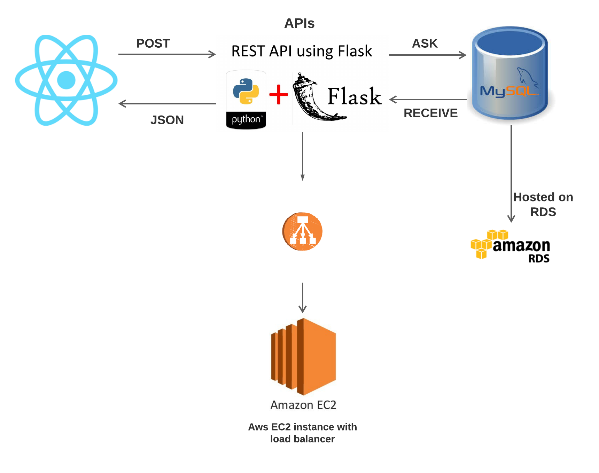
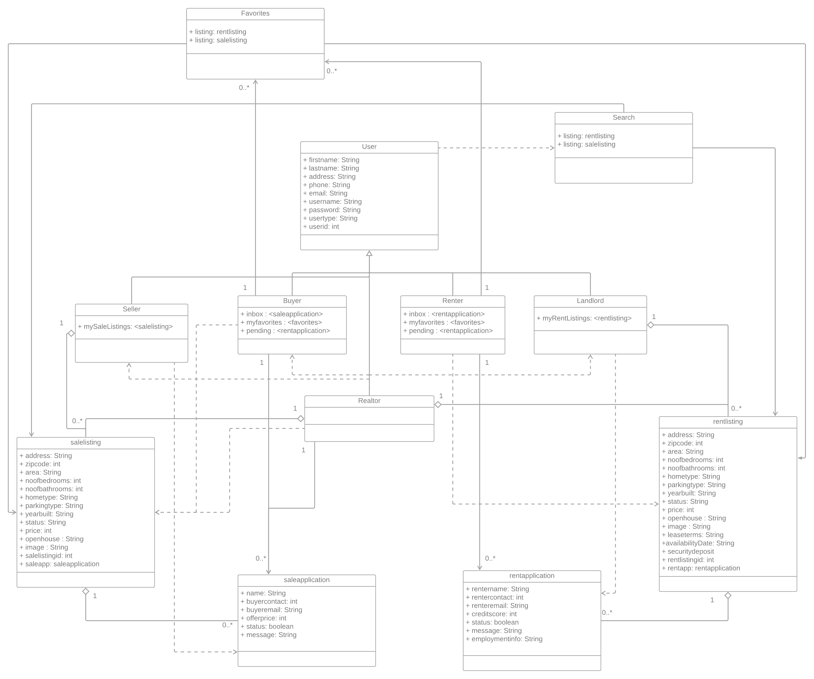
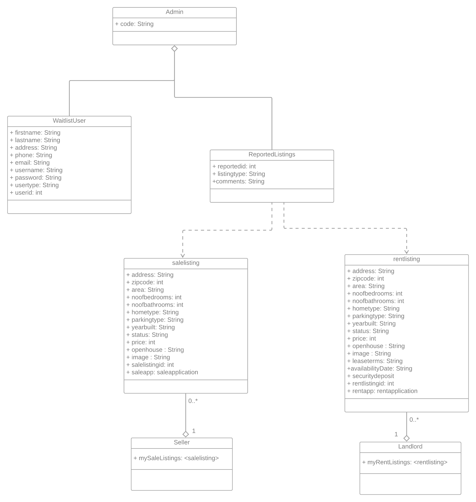
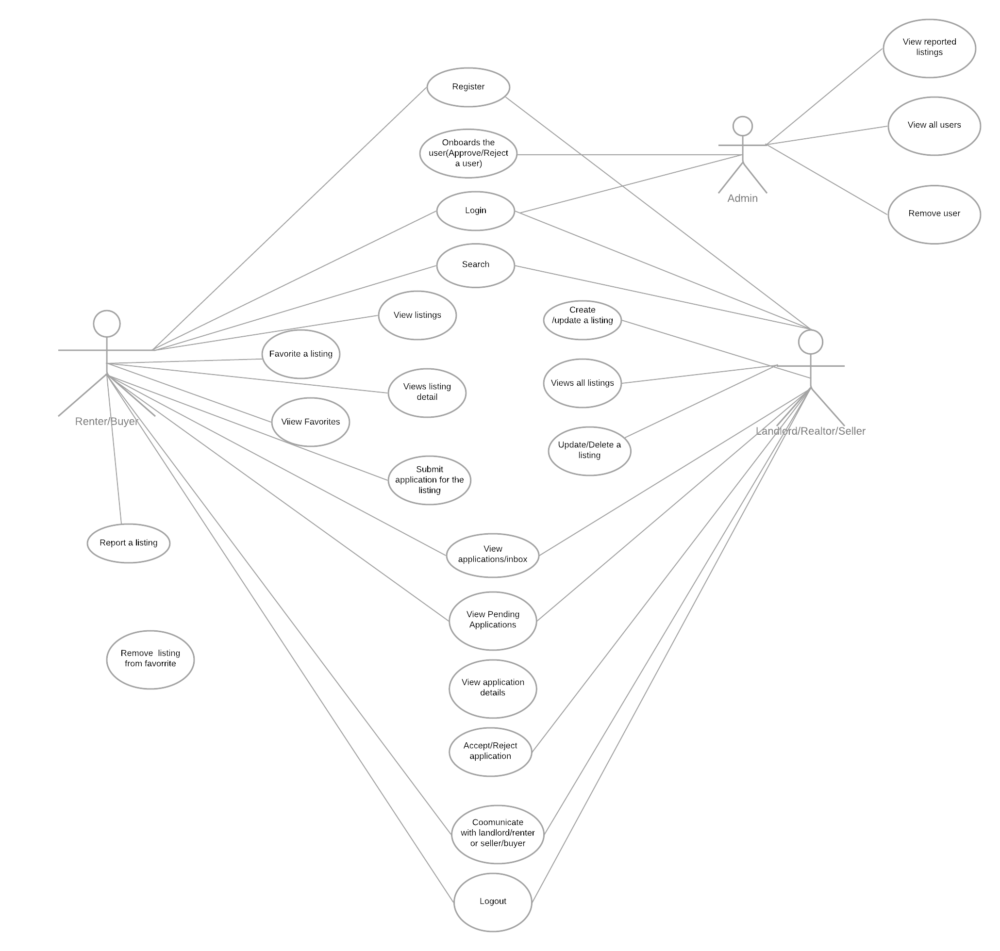
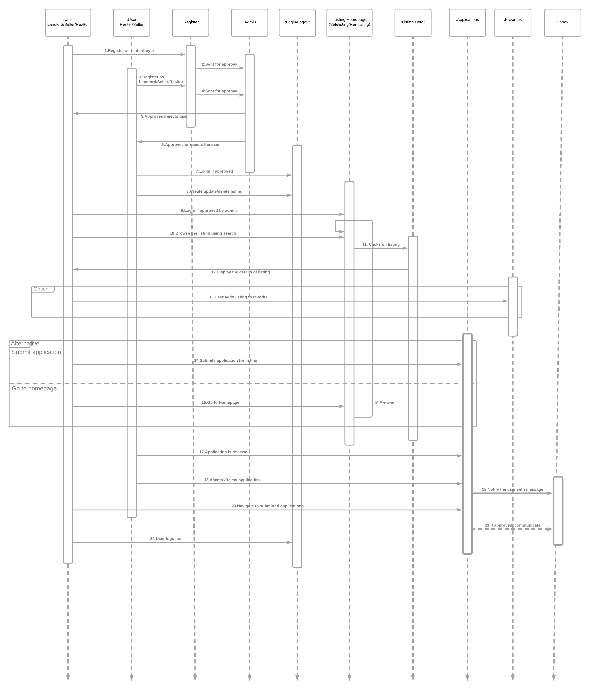
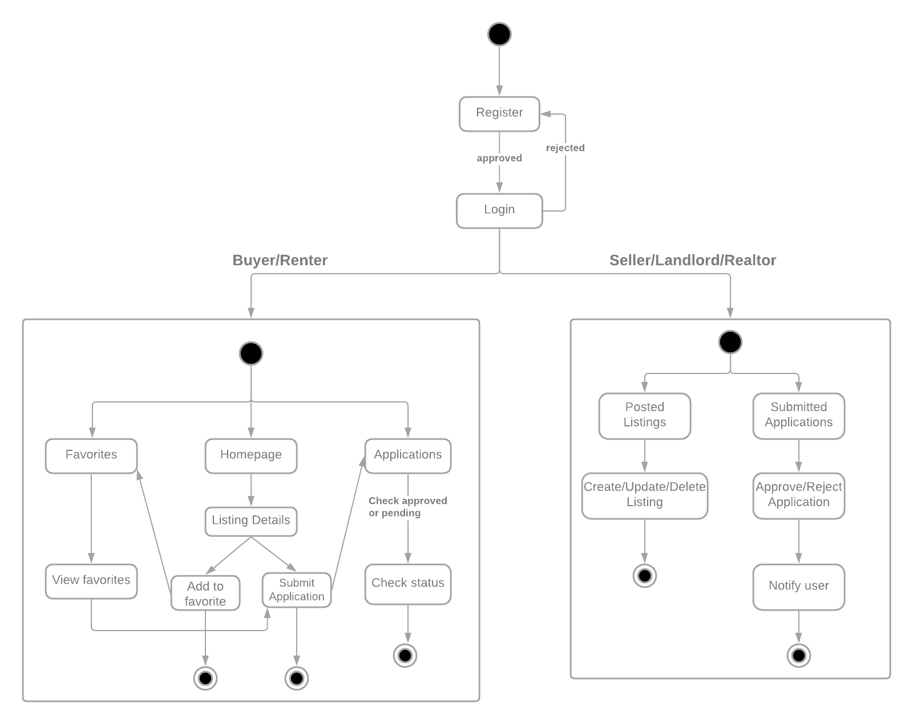
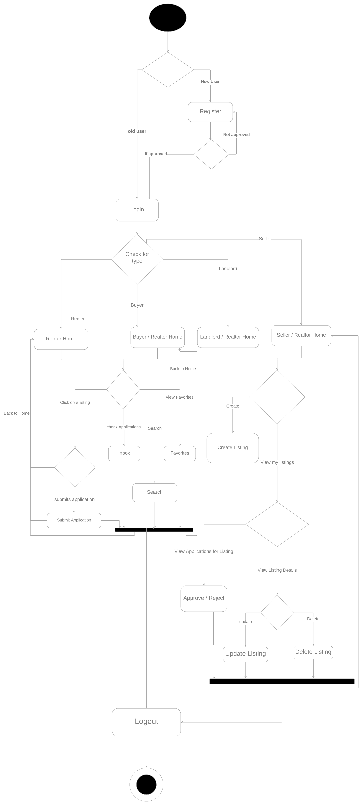

# HomeFinder

### FRONTEND
- Remote working front end team.
- Used React
- Backend implemented as per frontend team requested the data.

### BACKEND
- Me and my backend team mate.
- Developed the backend application in Python using Python Flask framework
- Developed the functionality for each of the features mentioned in the functional requirements
- Created REST APIs and returning data is JSON format using the cURL links for UI integration
- Created the MySQL Database schema and responsible for handling the dataflow.
- Flask app hosted on AWS EC2
- MySQL db instance on AWS RDS
- Kanban board updated on the Project Github board

### FEATURES AND DESIGN
Backend Features implemented as per roles: 

<h5>Admin:</h5> 
- Approve / Remove user  
- View all users 
- Remove any user 
- View Reported Listing by Buyer / Renter 
- Remove user based on Reported Listings 

<h5>Renter:</h5>
- View All Rentals 
- Listing Details / Submit application for that listing 
- inbox : view approved / rejected applications 
- view pending apps 
- Favorites : Add / Remove / View favorites 

<h5>Buyer / realtor: (depending who is logged in: relevant data will be displayed)</h5>  
- View All Sales 
- Listing Details / Submit application for that listing. (a gmail will be sent on localhost, smtp server) 
- inbox : view approved / rejected applications 
- view pending apps 
- Favorites : Add / Remove / View favorites 

<h5>Landlord / Realtor: (depending who is logged in: relevant data will be displayed)</h5> 
- Create Rental Listing. 
- View my Rent listings. 
  - Update / Delete 
- View applications of their listings.  
- approve / reject application with a note to renter 

<h5>Seller / Realtor: (depending who is logged in: relevant data will be displayed)</h5> 
- Create Sale Listing. 
- View my Sale listings. 
  - Update / Delete 
- View applications of their listings.  
- approve / reject application with a note to buyer or buyer realtor. 

<h5>Search: (depending who is logged in: relevant data will be displayed)</h5> 
- All can search. 

<h2> Design</h2>

<h3>Backend Deployed Components Diagram:</h3>

<h3>Database design:</h3>

<h3>Class Diagram:</h3>
<ul>
<li>
<h4> Class Diagram : Registered User </h4>
  </li>
   
  

<ul>
<li>
<h4> Class Diagram : Admin </h4>
  </li>
</ul>
 

<h2> Functionalities </h2>

<h3> Use case: </h3>

<h3> Sequence: </h3>

<h2> Decisions Design </h2>

<h3> State design: </h3>

<h3> Activity Diagram: </h3>

